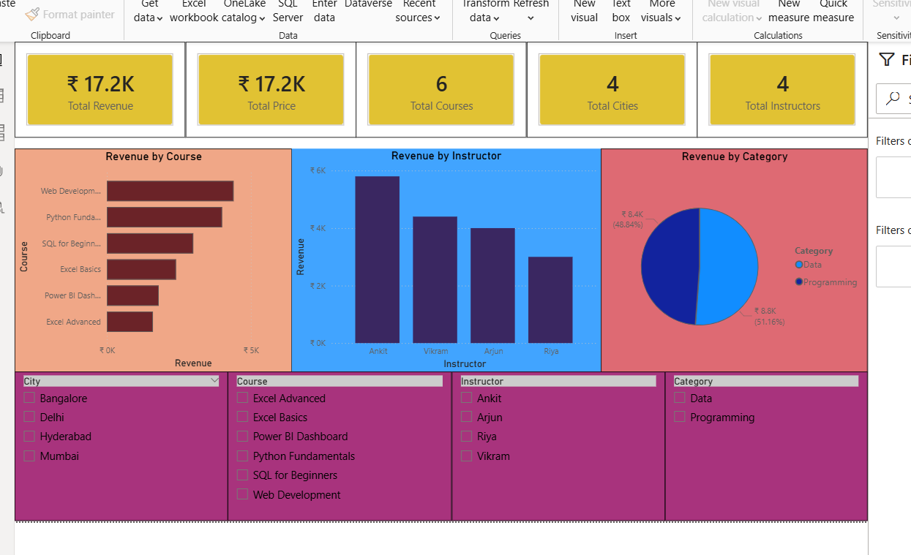

## Course Revenue Data Analysis

### Objective
Analyze course data to understand revenue distribution, instructor performance, and category trends.

### Tools Used
- Excel
- SQL
- Python (Pandas, Matplotlib)
- Power BI

### Analysis Performed
- Calculated revenue using enrollments and price
- Analyzed revenue by course
- Compared instructor performance
- Evaluated category-wise revenue
- Created visualizations for trends

### Key Insights
- Web Development course generates the higher revenue
- Instructor Ankit generates highest revenue among all the instructors
- Data category dominates the Programming category total revenue
- Revenue distribution is uneven across courses

### Files Included
- dataset.xlsx
- course_analysis.sql
- course_analysis.py
- course_analysis.pbix
